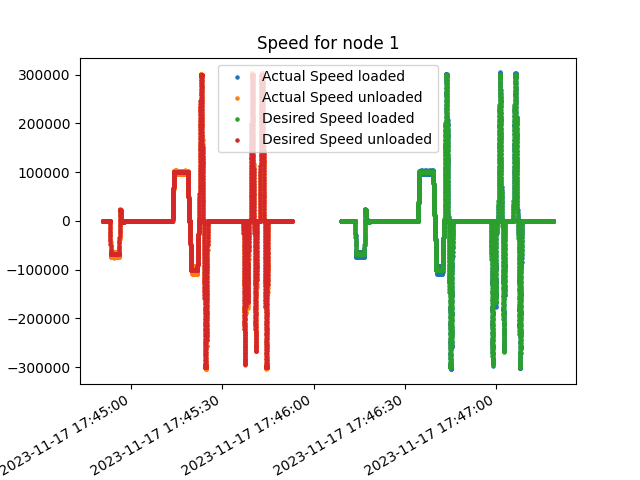
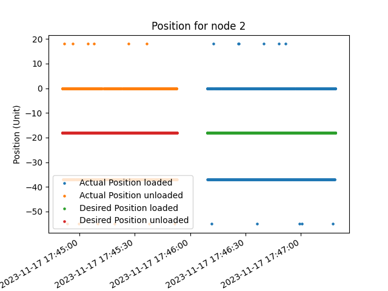
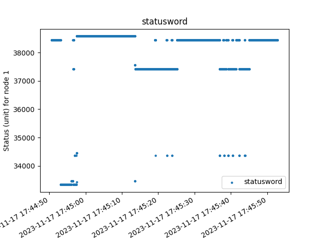
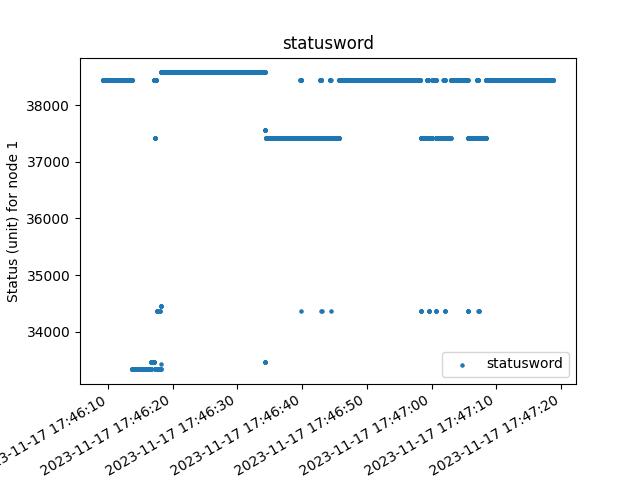
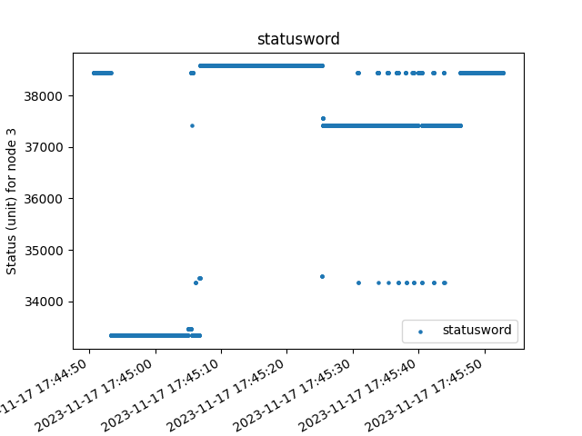
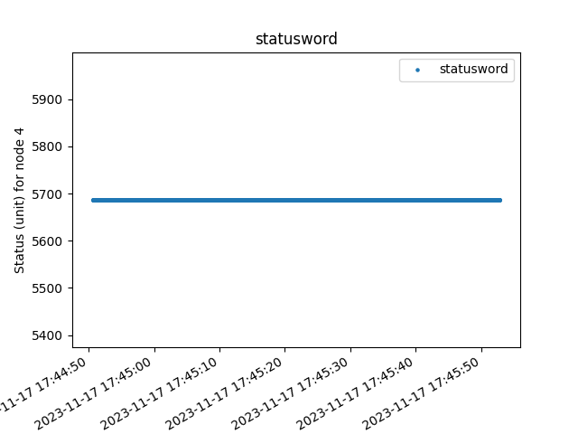

First I have plotted all the raw CAN data for the individual signals plotted separately, per node, and for the loaded/ unloaded cases, that is shown in the end.

Each node or drive, represents a separate motor. Since we know there are three types of moves with the following expectations:

- Homing
  - Moving or calibrating the motor to specific set point
- Individual moves
  - Setting desired final setpoint by following desired speed and position curves for the trajectory and expecting the actual values to match by producing appropriate calculated control and torque efforts
- Combined moves
  - Combined moves involve 2 or more motors at once 
  - Planned to have each motor start and stop at the same time
  - Each motor in a combined move is commanded to its own setpoint, like individual moves, aside from being synchronised

Based on that, it appears as though Drive 1 & 3 are being driven as a combined move and drive 2 and 4 seem like they could either be homing individual move. We can use the statusword as a reference, despite not knowing what the decrypted status is.

We see that Drive 2 is set for a close to 0 desired position when the status is 182.5 the whole time. We see for both drive 1 and 3, the status is 55, switches briefly to 182.5 when the position is 0 and goes back to 55 Based on that, we can assume that 182.5 is most likely homing.  Drive 4 seems to also be at 55, indicating a combined move, but it is missing any data about position and velocity so it will be ignored.

This can be seen in these normalized plots for the timing:
<table>
<td></td>
<td></td>
<td></td>
</table>

Next, I want to analyze the performace for these modes by answering the following questions:

1. Are the motors going at speeds they are expecting during moves?
2. Are the moves completed properly?
3. Are combined loads going slower than expected, especially during loads?
4. Are combined motors not starting and stopping at the same time?

# Validating Speeds
<table>
<td></td>
<td></td>
<td></td>
</table>

For drive 1, everything appears to be as expected. 

For drive 2, we can see there is a lot of noise deviating from a request to remain at rest. There is a lot of jitter. Compared to drive 1 and 3, the values in drive 2 are relatively low (note that we don't actually know the units in can since we don't know the range), this may mean that it is actually behaving as expected with a small margin of error, but it is not possible to tell with the given information.

For drive 3, we begin to actually see that the speeds are beginning to deviate from the desired under load, it is very slight. This can be due to an issue within the motor or an issue with the mode it is used in (ie maybe very high resistance) to check we can compare the control effort and torque in drive 1 and 3.

<table>
<td>
</td>
<td>
</td>
</table>

We can see that the effort is much higher for drive 3 especially when it's loaded. The load could be too high.

# Validating Position
<table>
<td></td>
<td></td>
<td></td>
</table>
Similar to speed, we see that drive 1 is fine, drive 2 has noise and is low, and drive 3 has deviations in the desired positon. The conclusions drawn are the same.

The speeds however, do not look like they are slower than desired conclusively, neither in the homing nor in the combined. The client may be incorrect about this insight.


# Validating Synchoranization
We can check that drive 1 and 3 are synchronized as follows:
<table>
<tr>
<td></td>
<td></td>
<td></td>
</tr>
<tr>
<td></td>
<td></td>
<td></td>
</tr>
</table>

From what it looks like, they are starting and stopping at very close times, to determine the exact difference, we will check the can data using python.

```
Desired:
Start time unloaded
(datetime.datetime(2023, 11, 17, 17, 46, 9, 163020), 800006)
(datetime.datetime(2023, 11, 17, 17, 46, 9, 180245), 200000)

End time unloaded
(datetime.datetime(2023, 11, 17, 17, 47, 18, 823554), 800006)
(datetime.datetime(2023, 11, 17, 17, 47, 18, 805456), 200000)

Start time loaded
(datetime.datetime(2023, 11, 17, 17, 44, 50, 616972), 800006)
(datetime.datetime(2023, 11, 17, 17, 44, 50, 633017), 200000)

End time loaded
(datetime.datetime(2023, 11, 17, 17, 45, 52, 812761), 800006)
(datetime.datetime(2023, 11, 17, 17, 45, 52, 819740), 200000)

Actual:
(datetime.datetime(2023, 11, 17, 17, 46, 9, 163020), 800024)
(datetime.datetime(2023, 11, 17, 17, 46, 9, 180245), 199997)

End time unloaded
(datetime.datetime(2023, 11, 17, 17, 47, 18, 823554), 799951)
(datetime.datetime(2023, 11, 17, 17, 47, 18, 805456), 200000)

Start time loaded
(datetime.datetime(2023, 11, 17, 17, 44, 50, 616972), 799988)
(datetime.datetime(2023, 11, 17, 17, 44, 50, 633017), 200003)

End time loaded
(datetime.datetime(2023, 11, 17, 17, 45, 52, 812761), 800024)
(datetime.datetime(2023, 11, 17, 17, 45, 52, 819740), 200000)
```

In reality both the desired and actual values appear to be really close, only off by a range tens of milliseconds.

```
For Desired:

Start time (unloaded): 17,225 microseconds
End time (unloaded): -18,098 microseconds
Start time (loaded): 16,045 microseconds
End time (loaded): 6,979 microseconds

For Atual:

Start time (unloaded): 17,225 microseconds
End time (unloaded): -18,098 microseconds
Start time (loaded): 16,045 microseconds
End time (loaded): 6,979 microseconds
```

# Conclusion
In summary, while Drives 1 and 3 exhibit good synchronization in combined moves, Drive 3 shows slight performance issues under load. Drive 2 displays considerable noise, which may be within acceptable limits but warrants further investigation. Drive 4 could not be analyzed due to lack of data. Overall, the system appears to function effectively, but certain aspects, like the load capacity on Drive 3 and the noise in Drive 2, could benefit from further scrutiny or adjustment.

# All Plots:
## Node 1
<table>
  <tr>
    <td>Desired</td>
    <td>Actual</td>
    <td>Desired Loaded</td>
    <td>Actual Loaded</td>
  </tr>
  <tr>
    <td></td>
    <td></td>
    <td></td>
    <td></td>
  </tr>
  <tr>
    <td></td>
    <td></td>
    <td></td>
    <td></td>
  </tr>
  <tr>
    <td></td>
    <td></td>
    <td></td>
    <td></td>
  </tr>
  <tr>
    <td></td>
    <td></td>
    <td></td>
    <td></td>
  </tr>
</table>

## Node 2
<table>
  <tr>
    <td></td>
    <td></td>
    <td></td>
    <td></td>
  </tr>
  <tr>
    <td></td>
    <td></td>
    <td></td>
    <td></td>
  </tr>
  <tr>
    <td></td>
    <td></td>
    <td></td>
    <td></td>
  </tr>
  <tr>
    <td></td>
    <td></td>
    <td></td>
    <td></td>
  </tr>
</table>

## Node 3
<table>
  <tr>
    <td></td>
    <td></td>
    <td></td>
    <td></td>
  </tr>
  <tr>
    <td></td>
    <td></td>
    <td></td>
    <td></td>
  </tr>
  <tr>
    <td></td>
    <td></td>
    <td></td>
    <td></td>
  </tr>
  <tr>
    <td></td>
    <td></td>
    <td></td>
    <td></td>
  </tr>
</table>

## Node 4
<table>
  <tr>
    <td></td>
    <td></td>
    <td></td>
    <td></td>
  </tr>
  <tr>
    <td></td>
    <td></td>
    <td></td>
    <td></td>
  </tr>
</table>